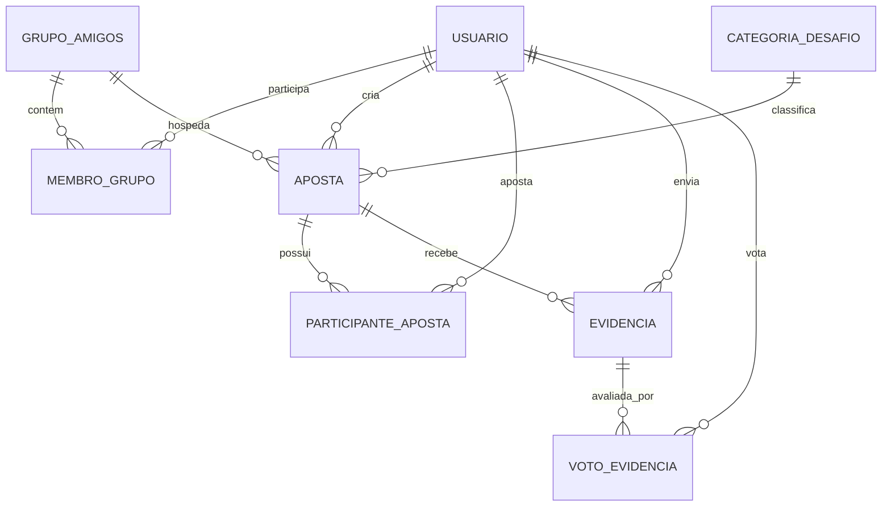

# 10 - Diagrama Entidade-Relacionamento (DER)

```mermaid
erDiagram
    USUARIO ||--o{ MEMBRO_GRUPO : participa
    GRUPO_AMIGOS ||--o{ MEMBRO_GRUPO : contem
    
    USUARIO ||--o{ APOSTA : cria
    GRUPO_AMIGOS ||--o{ APOSTA : hospeda
    CATEGORIA_DESAFIO ||--o{ APOSTA : classifica
    
    APOSTA ||--o{ PARTICIPANTE_APOSTA : possui
    USUARIO ||--o{ PARTICIPANTE_APOSTA : aposta
    
    APOSTA ||--o{ EVIDENCIA : recebe
    USUARIO ||--o{ EVIDENCIA : envia
    
    EVIDENCIA ||--o{ VOTO_EVIDENCIA : avaliada_por
    USUARIO ||--o{ VOTO_EVIDENCIA : vota
```
